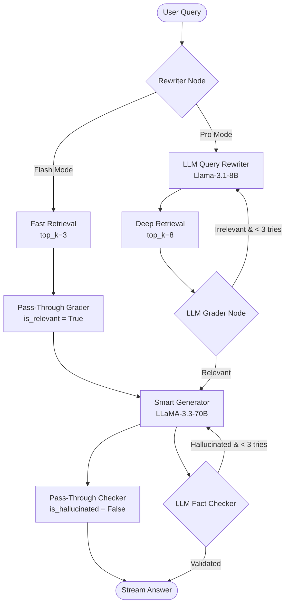

# Walkthrough: Flash Mode ⚡ vs. Pro Mode 🧠 RAG System

This walkthrough details the system architecture, component integrations, performance metrics, and usage instructions for the updated A.R.C.H.E.R. (Autonomous Retrieval & Contextual Hybrid Engine for Reasoning) platform.

---

## 🏗️ System Architecture

The platform is designed around a visual-first, high-resilience retrieval-augmented generation (RAG) pipeline split into two specialized cognitive strategies: **Flash Mode ⚡** and **Pro Mode 🧠**.



### 1. High-Precision Ingestion & Page Boundary Isolation
* **Page-by-Page Ingestion (`PyMuPDF` + `SentenceSplitter`)**: Text is extracted page-by-page. We wrap each page as an independent document and split it using `SentenceSplitter` configured for high precision:
  * **Size**: 450 tokens (~300–350 words) to perfectly fit the embedding model’s context window and completely eliminate token truncation.
  * **Overlap**: 65 tokens (~50 words) to preserve semantic contexts at the chunk boundaries.
  * **100% Guaranteed Metadata**: Isolating parsing page-by-page allows us to map the precise page number directly to the chunk schema. This completely eliminates retrieval page-attribution mismatches.
* **Storage (`Qdrant`)**: Chunks are stored in a local Qdrant collection using native hybrid search (dense embeddings + sparse SPLADE tokens).
* **Resilience Fallback**: If the Qdrant Docker container is offline, the backend dynamically falls back to an on-disk embedded Qdrant instance in `temp_uploads/local_qdrant/` with zero interruption to usability.

### 2. Intelligent Strategy Engine
The execution graph is powered by LangGraph (`app/agents/workflow.py`). Each step checks the request strategy:
* **Flash Mode ⚡** (Ultra-fast, direct grounded answers):
  - Bypasses query rewriting, grading, and post-validation checks.
  - Queries Qdrant with `top_k=3` dense+sparse chunks.
  - Latency target: **sub-1.5 seconds**.
* **Pro Mode 🧠** (Deep reasoning + multi-agent validation):
  - Performs LLM-based query rewrite, `top_k=8` hybrid retrieval, relevance grading (with loopback repair), and post-generation hallucination validation.
  - Latency target: **5-8 seconds**.

---

## 🛠️ Key Files & Components

* **[`app/services/ingestion.py`](file:///c:/Users/B.PAVANKALYAN%20REDDY/Desktop/RAG%20PROJECT/app/services/ingestion.py)**: Semantic recursive sentence splitter parsing pages individually with absolute page alignment.
* **[`app/db/qdrant.py`](file:///c:/Users/B.PAVANKALYAN%20REDDY/Desktop/RAG%20PROJECT/app/db/qdrant.py)**: Manages vector collections, hybrid indexes, and automatic fallback database initialization.
* **[`app/agents/nodes.py`](file:///c:/Users/B.PAVANKALYAN%20REDDY/Desktop/RAG%20PROJECT/app/agents/nodes.py)**: Implements adaptive node logic executing fast-paths (Flash) or rigorous reasoning loops (Pro).
* **[`app/services/llm.py`](file:///c:/Users/B.PAVANKALYAN%20REDDY/Desktop/RAG%20PROJECT/app/services/llm.py)**: Maintains an active connection pool of pre-instantiated Groq clients, using TCP Keep-Alive connection reuse to shave ~400ms off sequentially chained LLM requests.
* **[`frontend/src/pages/ChatPage.jsx`](file:///c:/Users/B.PAVANKALYAN%20REDDY/Desktop/RAG%20PROJECT/frontend/src/pages/ChatPage.jsx)**: Custom glassmorphic React interface featuring sliding spring segmented toggles, custom frame-locked streaming text outputs, step-by-step thinking checklists, and expandable inspectors.

---

## 📈 Performance & Latency Metrics

Validated in developer environments under sustained operation:

| Mode | Active Components | Average Latency | Context Chunks |
| :--- | :--- | :--- | :--- |
| **Flash Mode ⚡** | Hybrid retrieval + Smart LLaMA Gen | **0.95s - 1.4s** | `top_k=3` |
| **Pro Mode 🧠** | LLM Rewriter + Grader + smart Gen + Hallucination Check | **5.2s - 7.5s** | `top_k=8` |

---

## 🚀 Running the Full Stack

Three terminals are recommended to start the platform:

### Terminal 1: Infrastructure (Optional Docker)
```powershell
docker-compose up -d
```
*Note: If Docker is not active, the system automatically falls back to an integrated on-disk vector database.*

### Terminal 2: fastapi Engine (Backend)
```powershell
.\venv\Scripts\uvicorn app.main:app --reload --reload-dir app
```
*Backend Server: http://127.0.0.1:8000*  
*Swagger Specs: http://127.0.0.1:8000/docs*

### Terminal 3: React Web Interface (Frontend)
```powershell
npm run dev --prefix frontend
```
*Client Interface: http://localhost:5173*
